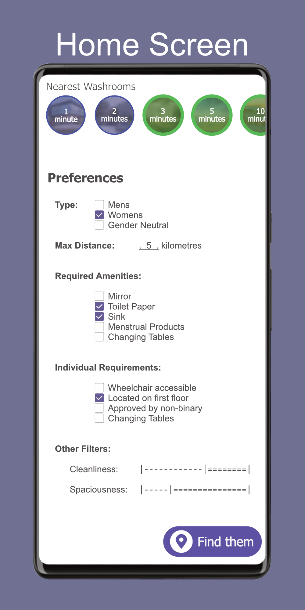
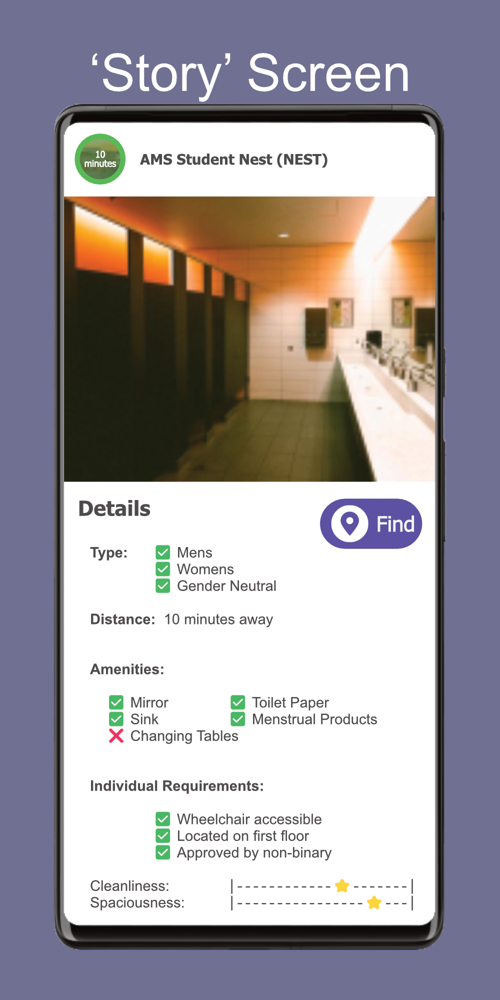
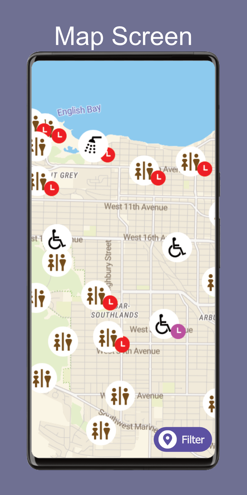
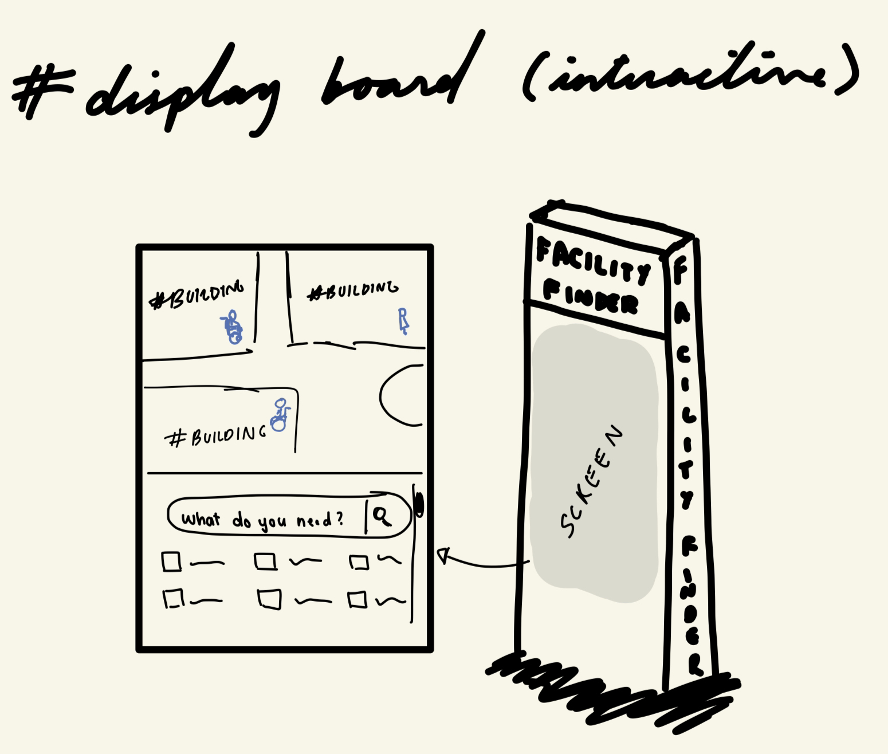
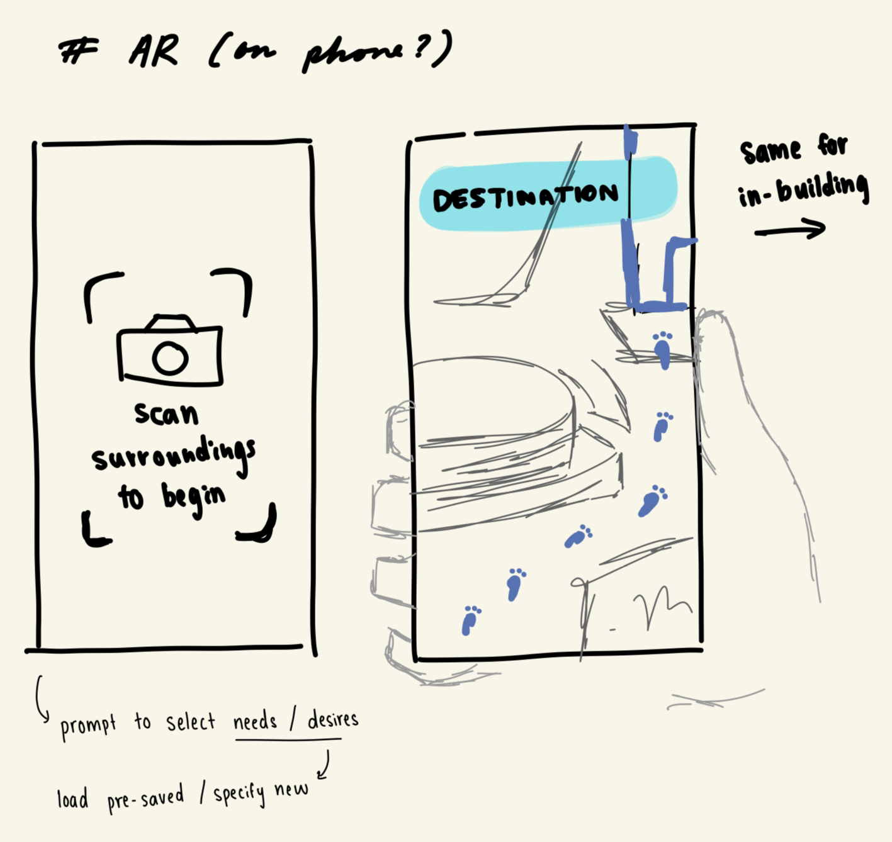
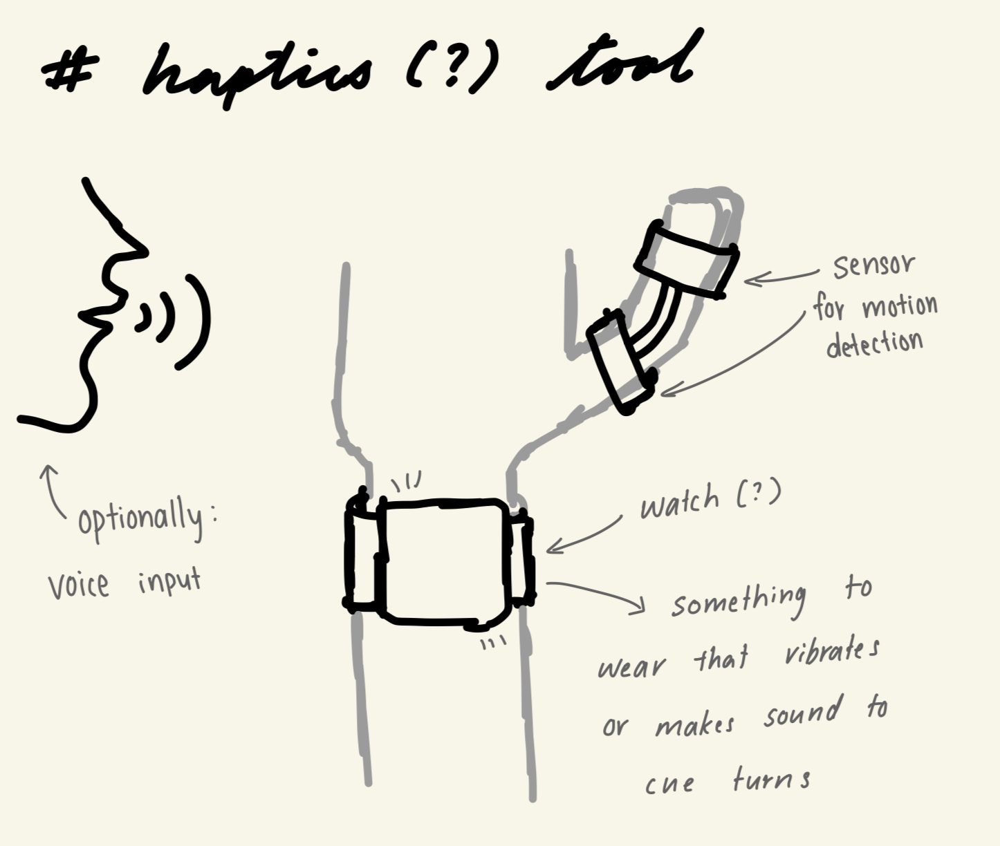

---
authors:
  - felicia
  - kae
  - justin
  - rafi

categories:
 - Project Update
 - CPSC 444

date: 2024-02-13

draft: false

slug: project-update-2

---

# Project Update 2

This blog post will include some revisions to the task examples, based on our notes after running a field study. We will also discuss the progress we have made on the project so far, and our recommendations for the next steps. This post will also include the major requirements and user groups that we intend to focus on. Finally, we will propose a few design ideas and alternatives for the project. 

<!-- more -->

## 2b. Task Examples

!!! quote "Original Task Examples"

    Task Example 1: Jeffrey
    
    Jeffrey is a biomedical engineering and experimental medicine graduate student at UBC. Jeffrey’s partner works on campus as well and he considers himself to be well familiar with general campus amenities. On days when they are both busy, they utilise UBC’s daycare service for their child. Jeffrey, his partner, and their child (Geoff) will often meet on campus after work/class before deciding on dinner plans. Geoff – being 13 months old, requires regular diaper changes. He prefers to do so in male bathrooms that have a changing table as he doesn’t like occupying the accessible bathroom unless absolutely necessary.  
    
    Jeffrey knows of 2 bathrooms on campus that have changing tables. One in his department’s building, and another close by to his and his partner’s usual meet spot. On occasion, his child will need a diaper change while he is exploring a new area of campus. During these times, Jeffrey typically opts for returning to 1 of his 2 safe bathroom spots as he is unfamiliar with which surrounding buildings have (ideally male) bathrooms with change tables, which buildings have restricted access, and where specifically the bathrooms are located within each building, etc.
    
    
    Task Example 2: Karen
    
    Karen is a parent taking photos of her son by the UBC fountain before his graduation ceremony. This is her first time on campus, so she is unfamiliar with the facilities. The ceremony is starting soon, so she wants to find a washroom nearby that she can access quickly without much walking since she is wearing uncomfortable shoes. Since it is a later in the day, she is not sure which buildings are open to the public and which ones need keycard access, such as those that are locked after a certain time. It would take some time to check each building for access and facilities, and she is not sure which one will be easiest to access for her. She can ask her son for directions, and he is able to direct her towards a building, but she does not know where to go after entering the building and needs a way to find further directions.   
    
    
    Task Example 3: Marie
    
    Marie is a new teaching staff member at UBC and requires a wheelchair to move across campus. She has not had an orientation of the buildings she is teaching in and is not familiar with where facilities are located. Marie has a very busy schedule, with lecture blocks right after each other. She needs to find a washroom between her classes that is wheelchair accessible. She also wants to find a washroom that is close to her next class but worries about washroom availability with many students also using this time to use the restroom. 

 

### Revised Task Examples

After conducting a field study, we have revised the task examples to better reflect the needs of our users.

!!! info ""

    **Revised Task Example 1: Jeffrey**

    Jeffrey is a biomedical engineering and experimental medicine graduate student at UBC. They are non-binary and thus feel more comfortable in gender neutral washrooms. They know of 2 bathrooms on campus that are gender neutral: one in their department’s building, and another in the Life building. On occasion, they will need to go to the washroom while exploring a new area of campus. During these times, Jeffrey typically opts for returning to one of their “safe” bathroom spots as they are unfamiliar with which surrounding buildings have gender neutral washrooms, which buildings have restricted access, and where specifically the bathrooms are located within each building. Depending on their current location on campus, they could be very far from the two gender neutral washrooms they know of. They would like to be able to easily and quickly find reliable information on what gender-neutral washrooms are nearby.  

!!! info ""

    **Revised Task Example 2: Karen**

    Karen is a parent taking photos of her son by the UBC fountain before his graduation ceremony. This is her first time on campus, so she is unfamiliar with the facilities. The ceremony is starting soon, so she wants to find a washroom nearby that she can access quickly without much walking since she is wearing uncomfortable shoes. Since it is a later in the day, she is not sure which buildings are open to the public and which ones need keycard access, such as those that are locked after a certain time. It would take some time to check each building for access and facilities, and she is not sure which one will be easiest to access for her. She can ask her son for directions, and he is able to direct her towards a building, but she does not know where to go after entering the building. She looks around for signs but finds none. Instead, she looks around for a floor map and finds an evacuation map that she uses to locate the washroom.  

!!! info ""

    **Revised Task Example 3: Marie**

    Marie is a new teaching staff member at UBC and requires a wheelchair to move across campus. She has not had an orientation of the buildings she is teaching in and is not familiar with where facilities are located. She needs to find a washroom between her classes that is wheelchair accessible. She also wants to find a washroom that is close to her next class but worries about washroom availability with many students also using this time to use the restroom. While on her way to her next class, she happens to find a suitable wheelchair accessible washroom in a quiet area. She has another wheelchair user friend who often has similar difficulty in finding washrooms, so she wants to share information about this washroom with her friend so they can also access it in the future.

 

**Justification:**

After completing the field study, we reevaluated our task examples. In particular, we added further detail to the Karen task example, reoriented our Jeffrey task example towards a new direction, and added a new requirement to the Marie task example. 

For the Karen task example, our original example ended when Karen located a suitable building. Following our field study results, we found that locating washrooms after entering buildings was just as important as finding a suitable building. As such, we adjusted our Karen task example to add further detail on what happens after she enters a building, and the strategies she might employ to locate a washroom.  

Our Jeffrey task example originally focused on a parent requiring changing tables to care for their child. During our field study however, we had difficulty acquiring data from parents with young children. While changing tables are an important amenity that can be incorporated as a filter option in our future prototypes, for now we will focus on the data we do have access to. We decided to reorient our task example to focus on an individual seeking gender-neutral washrooms as this was an important topic that we came across in our field studies. We adjusted the task example to replace known washrooms with changing tables to known gender-neutral washrooms, a situation we saw in one of our field study interviews. 

The premise of our Marie task example is mostly unchanged. Marie is still a wheelchair user who requires an accessible washroom, but we have now added the new requirement of notifying her friend after she finds a suitable washroom. During our field study, we noticed a theme of external accessibility tools often containing outdated info. Users with specific needs often rely on word of mouth among the community in order to find suitable bathrooms. To combine these findings, we added the requirement of providing relevant information to others to allow users to generate up-to-date public information.   

  

## 2a. Next Steps

Based on our observations and interview findings, participants consistently emphasized the importance of accessing live data about washrooms, particularly details related to cleanliness, amenities, and accessibility features, when deciding on a restroom. Moving forward, our focus for developing low-fidelity prototypes will center on aiding users in locating buildings with washrooms. Our research revealed that many participants already employ strategies to find a restroom once inside a building. 

Moreover, participants highlighted the inadequacy of information on various external apps, citing outdated content. In response, we aim to explore methods that enable users to provide verifiable and updated information regarding washroom conditions. To incentivize users to share this information, we are working on creating a positive and enjoyable experience, such as including a reward system that grants users points for their contributions. 

  

## 2c. Prioritized List of Requirements

After conducting our field study, we have identified a few requirements that we would like to prioritize. These requirements will be organized into `absolutely must include`, `should include`, `could include`, `could exclude`. We will also organize the different user groups, into the same four categories.

 

### Requirements

=== "Absolutely must include"

- filtering for washroom type (mens, womens, gender-neutral) 
- reporting the distance from current location     

=== "Should include"

- filtering for distance from current location
- the ability for users to update information on cleanliness and busy times
- reporting the presence of a sink and mirrors, and user inputted data on cleanliness and busy times

=== "Could include"

- filtering for the presence of a sink and mirrors, and user inputted data on cleanliness and busy times
- reporting the presence of menstrual products and toilet paper, and data on the number of stalls and urinals

=== "Could exclude"

- the ability for users to upload photos and add comments

 

### User Groups

While all user groups will benefit from the application, some user groups expressed that they did not have specific requirements as most washrooms on campus are already suitable. As such, with the limited research time that we have, we chose to prioritize a few specific user groups to ensure that we can meet every user's needs. 

=== "Absolutely must include"

- Users that are familiar with the UBC Vancouver campus
- Users that are unfamiliar with the UBC Vancouver campus

=== "Should include"

- Users with mobility impairments and other accessibility needs, such as wheelchair users, users with visual impairments, and Deaf users
- Users looking for gender-neutral washrooms

=== "Could include"

- Users with children, who require changing tables
- Users who require menstrual products
- Users who require sharps disposal containers

=== "Could exclude"

- Users with limited, or no specific requirements

  

## 2d. Design Alternatives

After completing our field study, we have identified a few design alternatives that we would like to explore further. 

 

!!! info "You can click on the design alternative images to view them in full size"

**Design 1: Mobile Application focussed on filtering**

Description: 

  - This design prioritizes the use of filters to help users find the information that applies to them. By placing the filters on the home page, users can quickly filter the washroom information across the application.
  - The user can see live updates of the filtering at the top of the screen, where there are 'story bubbles' with the nearest washrooms that meet the filter criteria. Tapping on a story bubble will bring up information for that washroom.
  - There are also buttons on most pages to access the map. The map will show the user's location and the location of the washrooms that meet the filter criteria.

<figure markdown="span"  >
{ align=left width=210px } 

{ align=left width=210px } 

{ align=left width=210px }

<figcaption>Collage design for the mobile application.</figcaption>
</figure>

PROS:

  - The filtering system is easy to use and understand.
  - The stories at the top of the screen are helpful for users who are in a hurry.
  - The map is accessible from most pages, making it easy for users to find their way to the washrooms.

CONS:

  - The filtering system may not be as helpful for users who are not sure what they are looking for.
  - The live updates may be distracting for some users.
  - The map may not be as helpful for users who are not familiar with the campus layout.

 

**Design 2: Interactive Display Board**

Description:

  - This design is a large interactive display board that is placed in a central location on campus. The board will show a map of the campus with the locations of the washrooms marked. Users can tap on a particular washroom on the board to find more information about the washrooms.

<figure markdown="span"  >

{ align=center width=500px } 

<figcaption>Drawing design for the interactive display board.</figcaption>
</figure>

PROS:

  - Such a board could be adapted to account for some accessibility needs, such as by using voice commands, providing audio and visual cues, etc.
  - There is a small learning curve, as such boards are used in many public spaces.
  - The large screen provides enough space to display a lot of information at once, and incorporate other features such as filtering

CONS:

  - There are high costs associated with the installation and maintenance of such a board.
  - The board may not be accessible to all users, such as those with limited vision or mobility impairments.  

 

**Design 3: AR Wayfinding App**

Description:

  - This app would allow the user to hold up their phone camera, and see the path to the nearest washroom overlaid on the camera view. The app would also have the option to view a map of the campus with the locations of the washroom marked, and to filter the washrooms based on the user's needs.

<figure markdown="span"  >

{ align=center width=500px } 

<figcaption>Drawing design for the AR wayfinding app.</figcaption>
</figure>

PROS:

  - This is a visual and interactive way to find washrooms, which may be helpful for users who are not familiar with the campus layout. It will show the exact path to the washroom, including inside of buildings.
  - Audio could be incorporated to provide directions for users with visual impairments.

CONS:

  -  Requires the user to hold up their phone for the entire duration of the walk to the washroom, which may be inconvenient for some users.

 

**Design 4: Haptics Wearable Tool**

Description:

  - This design is a wearable tool that uses haptic feedback to guide the user to the nearest washroom. The tool would vibrate when the user is facing the correct direction, and the vibrations would get stronger as the user gets closer to the washroom. The tool can also use the small screen of a smartwatch to display the distance to the washroom and other relevant information.

<figure markdown="span"  >

{ align=center width=500px } 

<figcaption>Drawing design for the haptics wearable tool.</figcaption>
</figure>

PROS:

  - This tool can be used by users with visual impairments, as it does not rely on visual cues.
  - This tool can be used without needing a screen, which is helpful for those holding items, using a cane, pushing a stroller, or walking in cold environments.

CONS:

-  This tool will have a steep learning curve, as it is not a common tool.
-  The minimal visual information may be annoying for users that are used to seeing a map or other visual information.

 

<!-- **Design 5: Direction Cube**

<figure markdown="span"  >

{ align=center width=500px } 

<figcaption>Potential design for the haptics wearable tool.</figcaption>
</figure>

PROS:
  - Tactile & interactive (accounts for blind, and ppl who need/want fidgets) 

CONS:

   - Needs to be held in hand 
   - Likely has to be preprogrammed with features 

  -->

